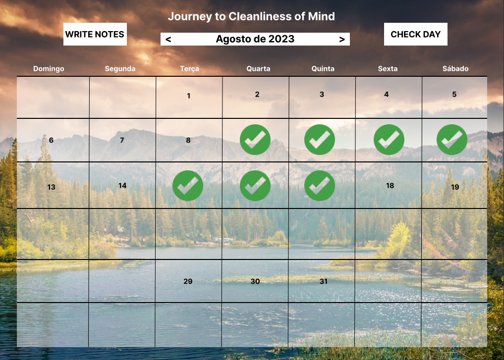

# Journey to Cleanliness of Mind - Calendar Desktop Application

## Introduction
"Journey to Cleanliness of Mind" is a desktop calendar application written in Java and JavaFX. The primary objective of 
this application is to help people stick with new habits by providing a simple and intuitive interface for tracking daily 
activities and making notes for each day.

The application allows users to mark the current day as "checked," indicating the successful completion of a habit or 
task. It also provides a space to store daily notes, fostering self-reflection and mindfulness throughout the journey of 
building new habits.

## Features
### Calendar View: 
Users can view the current month with marked days and easily navigate through months.
### Daily Check-in: 
Users can mark the current day as "checked" to indicate successful habit completion.
### Daily Notes: 
Users can write and save notes for each day, helping them reflect on their progress and experiences.
### User-Friendly Interface: 
The application provides an intuitive and aesthetically pleasing user interface for an enjoyable experience.
### Data Persistence: 
All data, including checked days and notes, are stored locally for easy access on subsequent launches.

## Contributing
Contributions to the "Journey to Cleanliness of Mind" calendar application are welcome! If you find any issues or have ideas for improvements, feel free to open an issue or submit a pull request.

## License
The "Journey to Cleanliness of Mind" calendar application is licensed under the MIT License. Feel free to use, modify, and distribute the application as per the terms of the MIT License.